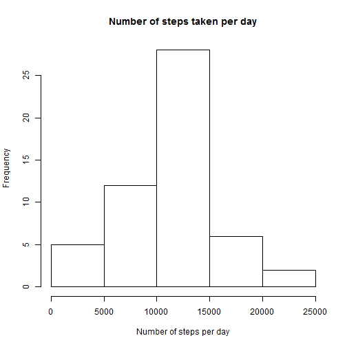
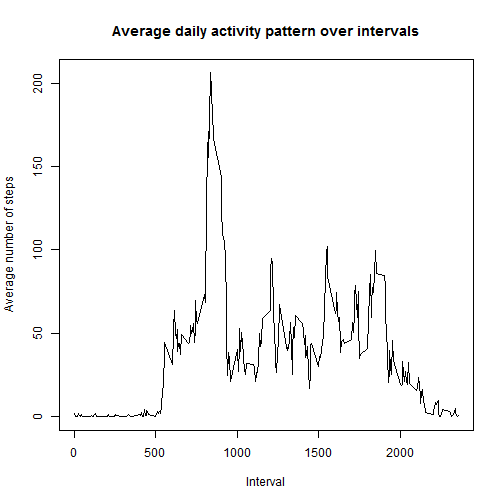
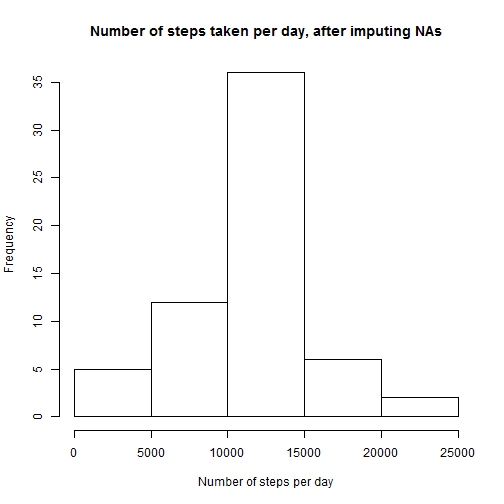
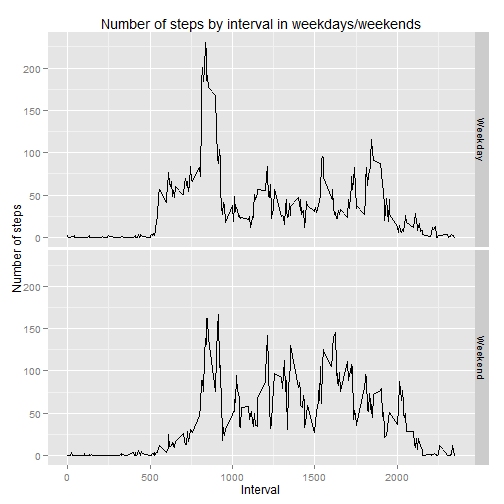

# Reproducible Research: Peer Assessment 1

## Loading and preprocessing the data

### Loading


```r
activity <- read.csv("activity.csv",header=TRUE,quote="\"")
```

### Preprocessing and cleaning
#### Convert date to date type


```r
activity$date <- as.Date(activity$date,format="%Y-%m-%d")
```

#### Convert interval to numbers


```r
activity$interval <- as.double(activity$interval)
```

#### Convert steps to numbers

```r
activity$steps <- as.double(activity$steps)
```

## What is mean total number of steps taken per day?
Sum of the number of steps taken per day

```r
total_daily_step <- aggregate(steps ~ date,data=activity,sum,na.rm = TRUE)
```

#### Make a histogram of the total number of steps taken each day

```r
hist(total_daily_step$steps
     ,xlab="Number of steps per day"
     ,main="Number of steps taken per day"
     ,)
```

 

#### Calculate and report the mean and median total number of steps taken per day
Mean of total daily number of steps is:

```r
mean(total_daily_step$steps)
```

```
## [1] 10766
```

Median of total daily number of steps is:

```r
median(total_daily_step$steps)
```

```
## [1] 10765
```

## What is the average daily activity pattern?
Aggregate the steps by interval


```r
interval_steps <- aggregate(steps~interval,data=activity,mean,na.rm=TRUE)
```

#### Make a time series plot (i.e. type = "l") of the 5-minute interval (x-axis) and the average number of steps taken, averaged across all days (y-axis)

```r
plot(x=interval_steps$interval,
     y=interval_steps$steps,
     type="l",
     xlab="Interval",
     ylab="Average number of steps",
     main="Average daily activity pattern over intervals")
```

 

#### Which 5-minute interval, on average across all the days in the dataset, contains the maximum number of steps?

```r
interval_steps [ interval_steps$steps==max(interval_steps$steps),]
```

```
##     interval steps
## 104      835 206.2
```

## Imputing missing values

#### Calculate and report the total number of missing values in the dataset (i.e. the total number of rows with NAs)

```r
sum(is.na(activity$steps))
```

```
## [1] 2304
```

#### Devise a strategy for filling in all of the missing values in the dataset. The strategy does not need to be sophisticated. For example, you could use the mean/median for that day, or the mean for that 5-minute interval, etc.

Fill in the missing values using the mean for that 5-minute interval.

#### Create a new dataset that is equal to the original dataset but with the missing data filled in.


```r
cleaned_activity <- 
    merge(activity,interval_steps,by.x = "interval",by.y = "interval")

cleaned_activity[is.na(cleaned_activity$steps.x),"steps.x"] <- 
        cleaned_activity[is.na(cleaned_activity$steps.x),"steps.y"]    

# rename steps.x to steps and drop steps.y
names(cleaned_activity)[2] = "steps"
cleaned_activity$"steps.y" <- NULL
```

#### Make a histogram of the total number of steps taken each day
Aggregate the steps up by date.

```r
cleaned_activity_daily_total <- aggregate(steps ~ date,data=cleaned_activity,sum)
```


```r
hist(cleaned_activity_daily_total$steps
     ,xlab="Number of steps per day"
     ,main="Number of steps taken per day, after imputing NAs"
     ,)
```

 

#### Calculate and report the mean and median total number of steps taken per day. 

```r
mean(cleaned_activity_daily_total$steps)
```

```
## [1] 10766
```

```r
median(cleaned_activity_daily_total$steps)
```

```
## [1] 10766
```

#### Do these values differ from the estimates from the first part of the assignment?
Mean has not changed.
Median increases by 1.

#### What is the impact of imputing missing data on the estimates of the total daily number of steps?

Summary of total daily number of steps before and after imputing:

```r
summary(total_daily_step)
```

```
##       date                steps      
##  Min.   :2012-10-02   Min.   :   41  
##  1st Qu.:2012-10-16   1st Qu.: 8841  
##  Median :2012-10-29   Median :10765  
##  Mean   :2012-10-30   Mean   :10766  
##  3rd Qu.:2012-11-16   3rd Qu.:13294  
##  Max.   :2012-11-29   Max.   :21194
```

```r
summary(cleaned_activity_daily_total)
```

```
##       date                steps      
##  Min.   :2012-10-01   Min.   :   41  
##  1st Qu.:2012-10-16   1st Qu.: 9819  
##  Median :2012-10-31   Median :10766  
##  Mean   :2012-10-31   Mean   :10766  
##  3rd Qu.:2012-11-15   3rd Qu.:12811  
##  Max.   :2012-11-30   Max.   :21194
```

Summarising from the statistics shown above, the impact of imputing missing data is minimal. The first quartile, median and third qarutile change. The mean, minimum and maximum number of steps stay the same.

## Are there differences in activity patterns between weekdays and weekends?

#### Create a new factor variable in the dataset with two levels - "weekday" and "weekend" indicating whether a given date is a weekday or weekend day.


```r
cleaned_activity$day <- weekdays(cleaned_activity$date)
cleaned_activity[cleaned_activity$day %in% c("Sunday","Saturday"),"day"] <- "Weekend"
cleaned_activity[cleaned_activity$day %in% c("Monday","Tuesday"
                            ,"Wednesday","Thursday","Friday"),"day"] <- "Weekday"
cleaned_activity$day <- as.factor(cleaned_activity$day)
```

#### Make a panel plot containing a time series plot (i.e. type = "l") of the 5-minute interval (x-axis) and the average number of steps taken, averaged across all weekday days or weekend days (y-axis). 


```r
cleaned_activity_interval_steps <- aggregate( steps~ day + interval
                                            ,data=cleaned_activity,mean,na.rm=TRUE)

library(ggplot2)
qplot(x=interval
      ,y=steps
      ,data=cleaned_activity_interval_steps
      ,geom=c("line")
      ,facets=day~.
      ,ylab="Number of steps"
      ,xlab="Interval"
      ,main="Number of steps by interval in weekdays/weekends"
)
```

 
